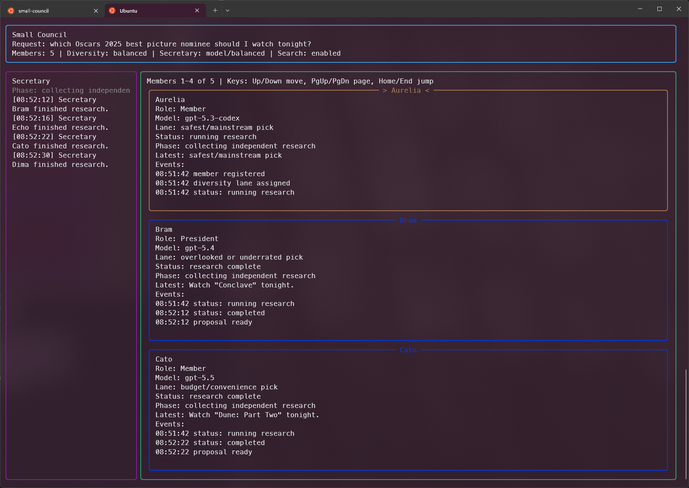

# Small Council

A CLI-first personal decision council powered by provider-aware model agents.



## Run

```bash
chmod +x ./council
./council --init
./council --members
./council "What movie should I watch tonight?"
```

The app stores all council config, prompts, state, logs, temp files, and generated agent definitions inside this project directory.

## Providers

Small Council supports multiple model providers in the same run. Each persisted council member has a sticky `provider` and `model` assignment, so changing config does not reroll existing members. New members are assigned from the effective model pool when they are created.

Initial providers:

- `codex`: runs the Codex CLI with project-local auth.
- `ollama`: runs local Ollama models through `http://localhost:11434`.

Example mixed council state:

```json
{"name": "Aurelia", "provider": "codex", "model": "gpt-5.5"}
{"name": "Bram", "provider": "ollama", "model": "qwen3:8b"}
```

Legacy state without `provider` is treated as `codex`.

## Codex Setup

The orchestrator runs Codex with `CODEX_HOME=$PWD/.codex` and `--ignore-user-config`, so it does not depend on `~/.codex/config.toml`.

On first use, authenticate Codex into the project-local home:

```bash
CODEX_HOME=$PWD/.codex codex login
```

Then check:

```bash
./council --doctor
```

Codex model discovery uses the Codex CLI model catalog when available and falls back to configured static models if discovery fails.

## Ollama Setup

Install Ollama, pull local models, then enable the provider:

```bash
ollama pull qwen3:8b
ollama pull deepseek-r1:8b
./council --set model_providers.ollama.enabled=true
```

Ollama discovery uses `/api/tags` and execution uses `/api/chat`. Configure connection and runtime options in `config/council.yaml`:

```yaml
model_providers:
  ollama:
    enabled: true
    base_url: http://localhost:11434
    request_timeout_seconds: 300
    options:
      temperature: null
      num_ctx: null
```

## Model Discovery And Filtering

Each enabled provider builds an effective model pool the same way:

1. Discover models when `discover_models: true`.
2. Add `static_models`.
3. Filter by `max_parameters`.
4. Apply `enabled_models` if non-empty.
5. Remove `disabled_models`.

For Ollama, parameter size is read from provider metadata when available and otherwise inferred from names like `qwen3:8b`, `gemma3:12b`, and `llama3.3:70b`.

```yaml
model_providers:
  codex:
    enabled: true
    discover_models: true
    static_models:
      - gpt-5.5
    disabled_models:
      - codex-auto-review
  ollama:
    enabled: true
    discover_models: true
    static_models:
      - qwen3:8b
    max_parameters: 12b
    allow_unknown_size_models: false
```

List what the app sees:

```bash
./council --models
./council --doctor
```

## Output And Progress

Decision output is human-readable by default. Use JSON when you want a structured payload:

```bash
./council --json-output "What movie should I watch tonight?"
```

The CLI uses Rich TUI output by default for human-readable runs when Rich is installed. Use `--plain-output` for plain text, or `--json-output` for machine-readable JSON. If Rich is unavailable, the CLI falls back to plain text.

In Rich mode, use `Left`/`Right` to switch between the Secretary and council member areas. `Up`/`Down` scrolls the active area; `PageUp`/`Home` and `PageDown`/`End` jump to oldest/newest Secretary updates or first/last council member depending on the active area. After the final decision, use `Esc` or `Enter` to close the TUI. Narrow terminals fall back to a vertical layout so the Secretary and members remain readable.

The Secretary prints short immediate progress updates for completed events on stderr, then milestone summaries after the larger council phases: initial proposals, each discussion round, final proposals, proposal grouping, the initial vote, and any runoff votes.

The Secretary is non-voting and does not count as a council member. A model-backed Secretary is the default and uses the same provider router as council members. Configure it independently:

```yaml
secretary:
  provider: ollama
  model: qwen3:8b
```

The local Secretary remains available for deterministic/offline runs:

```bash
./council --secretary local "Where should I go for dinner?"
./council --secretary model --secretary-verbosity balanced "Where should I go for dinner?"
./council --no-secretary-immediate-updates "Where should I go for dinner?"
```

Supported model-backed verbosity levels are `low`, `balanced`, and `high`.

After the initial draft proposals, the council enters a threaded discussion phase, revises those drafts, then groups equivalent final proposals before voting.

## Proposal Diversity

The council uses `balanced` proposal diversity by default. Each member gets a recommendation lane during independent research so open-ended questions produce a broader set of options.

```bash
./council --set-diversity high "What should I cook tonight?"
```

Supported modes are `low`, `balanced`, and `high`.

## Files

- `config/council.yaml`: member names, provider config, model filters, personality pool, storage paths.
- `storage/council-state.json`: persisted member identities and stats.
- `storage/leaderboard.json`: persisted leaderboard.
- `agents/definitions/`: generated persistent member definitions.
- `runtime/logs/`: Codex subagent run logs.
- `.codex/`: project-local Codex auth/session home.

## Reset

```bash
./council --reset --init
```

This rerolls models, personalities, and President assignment.

## Resize The Council

```bash
./council --set-members 7 --members
./council --add-members 1 --members
./council --remove-members 2 --leaderboard
```

Increasing the council keeps existing members unchanged and creates new persistent members with generated names when the configured names are exhausted. Reducing the council removes members from the end of the active roster and deletes their generated agent definitions and stats.

## Tie Runoffs

If multiple options tie for the highest vote count, the council removes all lower-scoring options and votes again on only the tied options. The council gets 3 runoff rounds by default. If no single winner emerges after every runoff round, the President makes one final tie-break call. If that tie-break cannot be completed, the final answer presents all remaining tied options instead of inventing a winner.

Override the runoff limit for a single decision:

```bash
./council --set-runoff-rounds 5 "What should I cook tonight?"
```

Before voting, the President groups effectively identical recommendations into one canonical option. If that grouped option wins, every member who independently proposed it receives a win.

## Config Updates

Persist config changes with `--set`:

```bash
./council --set secretary.provider=ollama
./council --set secretary.model=qwen3:8b
./council --set model_providers.codex.enabled=false
./council --set model_providers.ollama.max_parameters=12b
```

## Model Overrides

Edit `config/council.yaml` to pin a member later:

```yaml
model_overrides:
  Bram:
    provider: ollama
    model: qwen3:8b
```

Legacy Codex-only override syntax still works:

```yaml
model_overrides:
  Bram: gpt-5.5
```

Overrides must stay inside the effective provider model pool.
